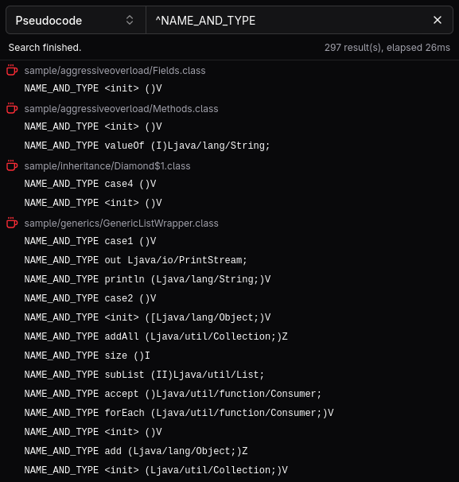

To enable features, such as the integrated pseudocode disassembler and the [class view](/reference/class), slicer creates in-memory models of classes.

By default, a partial version of the model is created for all classes in the background - this is called background analysis.
When a class is to be disassembled or the like, a full version of the model is created and cached.

:::tip

If you expect to load a large amount of classes (i.e. tens of thousands) into the workspace, you may want to disable background analysis
(`Analysis` -> untick `Background`) and rely only on just-in-time analysis to save on time and memory costs.

:::

## Search

Search allows you to search for identifying aspects of class files, such as constant pool values and class members.

The search tab can be opened like any unscoped tab, using `Analysis` -> `Search` or by pressing `Ctrl+Shift+F`.

There are three search modes, selectable in the dropdown menu:

- Partial match (case-sensitive)
- Exact match (case-sensitive)
- Regular expression (RegEx pattern occurrences)

:::tip

Regular expressions are a powerful way to search almost anything in the class file, so don't hesitate to use them!

| Notation   | Description                           |
| ---------- | ------------------------------------- |
| `^`        | Start                                 |
| `$`        | End                                   |
| `\d`       | Any digit                             |
| `.`        | Any character                         |
| `[abcdef]` | Any character from the set            |
| `*`        | Match preceding token 0 or more times |
| `+`        | Match preceding token 1 or more times |
| `?`        | Match preceding token 1 or 0 times    |
| `(?i)`     | Case-insensitive flag                 |

:::

### Constant pool

Searching in the constant pool is done by checking for matches against [disassembled representations](/reference/disasm#constant-pool) of the underlying entries.

Commonly searched aspects and queries may look like this:

| Searching?                     | Mode               | Query                               |
| ------------------------------ | ------------------ | ----------------------------------- |
| All strings in the class file  | Regular expression | `^STRING`                           |
| Reference to a specific class  | Exact match/any    | `CLASS package/SearchedClass`       |
| Reference to a specific field  | Exact match/any    | `NAME_AND_TYPE theField Lthe/Type;` |
| Reference to a specific method | Exact match/any    | `NAME_AND_TYPE theMethod ()V`       |

### Members

Members are searched by their name and descriptor, delimited by a space: `theField Lthe/Type;` or `theMethod ()V`.

Commonly searched aspects and queries may look like this:

| Searching?                            | Mode               | Query                 |
| ------------------------------------- | ------------------ | --------------------- |
| Any field/method with a specific name | Regular expression | `^theField`           |
| Any method returning a specific type  | Regular expression | `)Lthe/Type;$`        |
| Specific field                        | Exact match/any    | `theField Lthe/Type;` |
| Specific method                       | Exact match/any    | `theMethod ()V`       |

## Transformers

Transformers are a convenient way to _transform_ class files before they're analyzed (just-in-time).
They can be applied in the `Analysis -> Transformers` menu.

slicer includes several options that may improve the chances of successful disassembly when dealing with obfuscated code.

:::note

The scripting API `preload` [event](/script/event) is also implemented as a transformer, and it is run as the _last_ transformer in the pipeline.

:::

### Readability

Readability transformers perform **destructive** transformations, which may help with readability of decompiled output in particular.

| Name                      | Description                                                                                                        |
| ------------------------- | ------------------------------------------------------------------------------------------------------------------ |
| Strip annotations         | Removes annotation-related attributes (`*Annotations`, `AnnotationDefault`), useful for mitigating "ASM crashers". |
| Strip try-catches         | Removes exception table entries in `Code` attributes, useful when dealing with flow obfuscation.                   |
| Strip local variables     | Removes `LocalVariable(Type)Table` and `MethodParameters` attributes, useful when dealing with name obfuscation.   |
| Strip synchronized blocks | Replaces all `monitorenter` and `monitorexit` instructions with `pop` instructions.                                |
| Strip generic signatures  | Removes `Signature` attributes, useful when dealing with name obfuscation.                                         |
| Strip debug information   | Removes `Deprecated`, `SourceFile`, `SourceDebugExtension` and `LineNumberTable` attributes.                       |

### Normalization

Normalization transformers perform functionally equivalent transformations, which mitigate common obfuscation techniques.

| Name                           | Description                                                                                                               |
| ------------------------------ | ------------------------------------------------------------------------------------------------------------------------- |
| Verify attributes              | Attempts to selectively strip attributes containing garbled data, mainly intended to mitigate "ASM crashers".             |
| Remove unnecessary modifiers   | Removes `ACC_SYNTHETIC` and `ACC_BRIDGE` access modifiers where appropriate, useful when dealing with access obfuscation. |
| Remove unnecessary try-catches | Removes exception table entries with nonsense ranges and/or handlers that only rethrow the caught exception.              |
| Remove unused local variables  | Replaces local variable store instructions with `pop` instructions if the variables are never read.                       |
| No-op unreachable code         | Replaces unreachable code with `nop` instructions.                                                                        |

#### Verification

The verification algorithm used in the `Verify attributes` transformer modifies the class file in an attempt to make it
readable by bytecode libraries that were not designed with JVMS violations in mind.

Violations of the class file specification are usually a product of an obfuscator attempting to thwart analysis, as in
many cases, these class files are still readable by JVMs.

The transformer does the following:

- remove attributes that couldn't be parsed
- remove attributes defined in an invalid context (e.g. `Code` attribute on an abstract method)
- remove attributes with invalid constant pool references (index out of bounds, wrong entry type)
