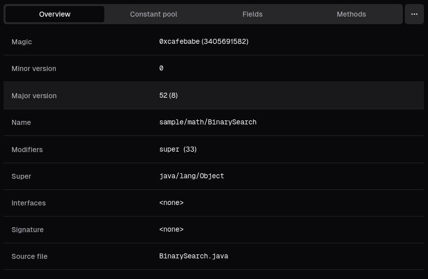
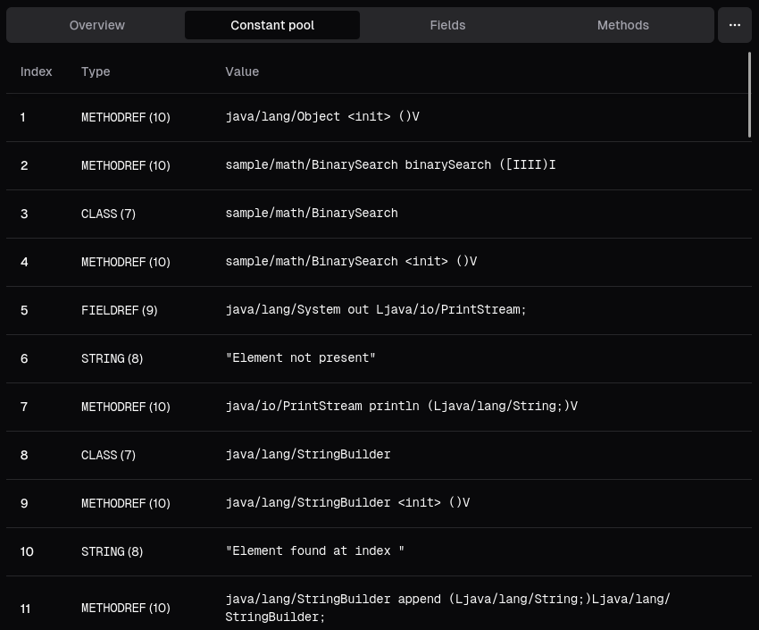
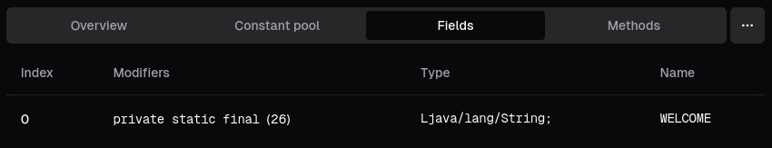
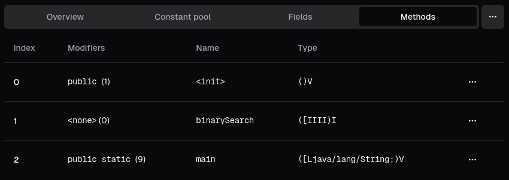

slicer provides a tabular view of a class file's properties and members, useful for analyzing class files when disassemblers fail.

## Overview

The Overview tab lists basic properties, such as:

- the magic header (should always be `0xcafebabe`)
- minor & major version (+ a corresponding Java language version)
- the class name & modifiers
- the super types (superclass and implemented interfaces)
- generic signature, if present
- source file attribute, if present

## Constant pool

The Constant pool tab lists constant pool entries with their respective human-readable type and value.

:::note

Many constant pool entries refer to other constant pool entries inside of them; slicer does not display indexes of
these references - only the values of the referenced entries are displayed (for now).

:::

## Fields & methods

The Fields and Methods tabs list the class' members with a human-readable representation of their modifiers and a raw name & type.

:::tip

A dropdown menu beside each method entry allows you to view its flow graph or disassembly!

_Note, not all disassemblers are available for single-method disassembly._

:::

