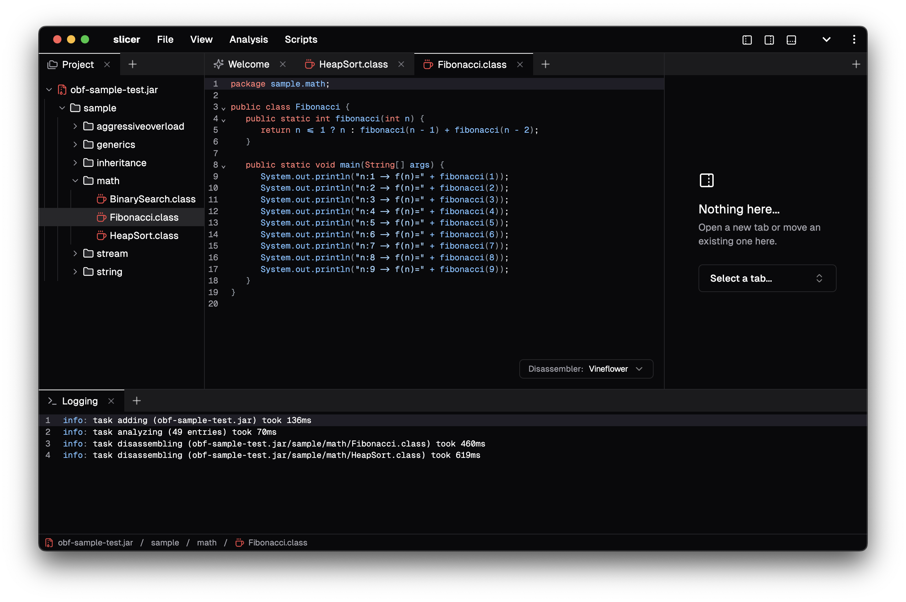

import { LinkButton, Card, CardGrid } from "@astrojs/starlight/components";

  

    

      slicer is a modern Java reverse engineering tool, built with an emphasis on simplicity and convenience.

      It runs in the browser, so you can use it anywhere, anytime, without installing anything.

      No data is sent to any server, everything runs locally in your browser, including decompilers.
    

    

      <LinkButton
        href="https://slicer.run"
        variant="primary"
        icon="external"
        iconPlacement="end"
      >
        Get started
      </LinkButton>
      <LinkButton
        href="/slicer/reference"
        variant="secondary"
        icon="right-arrow"
        iconPlacement="end"
      >
        Read the reference
      </LinkButton>
    

  

  

## Features

<CardGrid stagger>
  <Card title="Disassembly" icon="pencil">
    Disassemble and decompile Java class files using various decompilers like CFR, Vineflower, Procyon, and more.
  </Card>
  <Card title="Graphing" icon="random">
    Visualize inheritance and interface implementation within a workspace, as well as bytecode control flow via a
    [CFG](https://en.wikipedia.org/wiki/Control-flow_graph). Exportable to a PNG/SVG!
  </Card>
  <Card title="Search" icon="magnifier">
    Search for constant pool entries, classes, methods, and fields in the workspace using a powerful search engine.
  </Card>
  <Card title="Scripting" icon="setting">
    Write scripts in JavaScript to automate tasks, manipulate disassemblers, and extend slicer's functionality.
  </Card>
</CardGrid>

## Motivation

All of this has stemmed from an experiment of running the [CFR](https://github.com/leibnitz27/cfr)
Java decompiler in a browser using TeaVM, which ended up working pretty well, so I made this thing around it.

slicer's being built for the sake of having fun building it, so don't expect any crazy features -
if you want to do serious reverse engineering, use [Recaf](https://github.com/Col-E/Recaf);
if you want to quickly look at a class file, and you don't want to set anything up locally, stay here.

_This is what happens when you let a backend developer do frontend, so enjoy the programmer art design._

## Licensing

slicer is licensed under the [MIT License](https://github.com/katana-project/slicer/blob/main/LICENSE), however it also includes components
licensed under the [Apache License 2.0](https://www.apache.org/licenses/LICENSE-2.0),
such as the Vineflower and Procyon decompiler.
