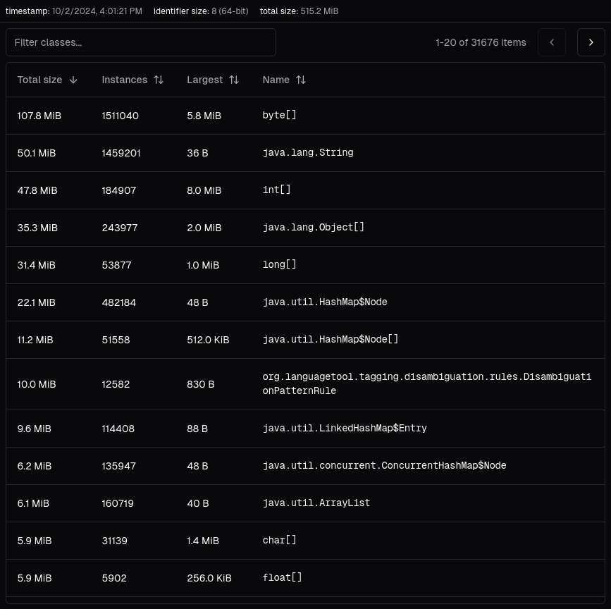

slicer provides a simplistic overview of a JVM's heap structure described by a HPROF file.

:::caution

HPROF files can be very large in size, and despite slicer's efforts, analysis of them can be very memory-, I/O- and CPU-intensive.

As of now, it is also advised to use a V8-based browser (i.e. Chromium) rather than ones based on SpiderMonkey or JavaScriptCore (i.e. Firefox or Safari) when analyzing heap dumps - this is purely for performance reasons; the analysis will work the same, however it may be significantly slower.

:::

slicer does not perform extensive analysis, e.g. memory leak detection, which tools such as [Eclipse MAT](https://eclipse.dev/mat/) and [VisualVM](https://visualvm.github.io/) do, it instead creates heap summaries.

A heap summary is a listing of all types on the heap, such as class instances, object arrays and primitive arrays.

:::note

Class instance sizes are merely educated estimates - it is impossible to concretely define them without having access to the actual heap of the JVM, read more [here](https://shipilev.net/blog/2014/heapdump-is-a-lie/).

:::

