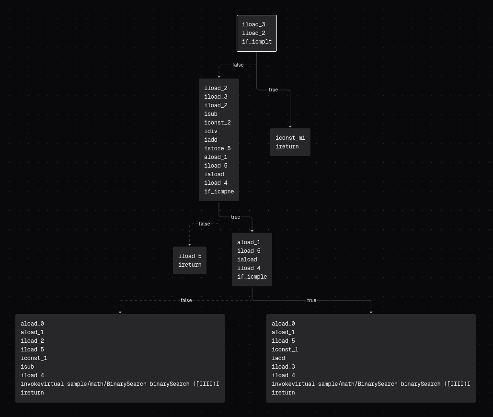
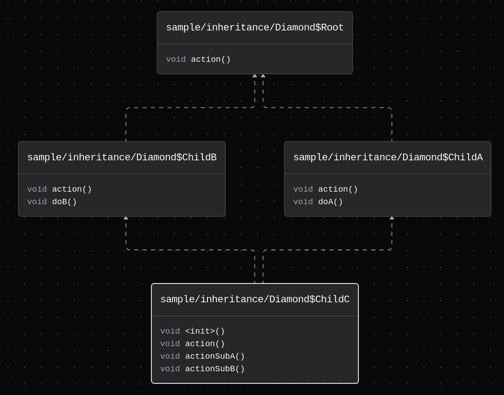

slicer allows you to explore the control flow of a method and an inheritance graph of a class using a flow diagram.

This view can be opened in the context menu of a project entry (`Open as` -> `Graph`) or in the menu bar for an already opened view of a class file (`View` -> `Graph`).

## Control flow

The control flow graph visualizes bytecode execution in a method using a top-to-bottom flow diagram.

If a graph has no nodes and no edges, it is likely an abstract method, which has no `Code` attribute.

### Nodes

A node is a block of instructions, which are executed sequentially. The node containing the zero-offset (first) instruction is called the entrypoint node and is highlighted with a special border (primary color of the UI - white, black, ...).

Every node that does not naturally (without a jump) pass off execution to another node must end with a branch (if, goto, switch or subroutine jump) or terminal instruction (return, throw or subroutine return), otherwise it does not pass [class file verification](https://docs.oracle.com/javase/specs/jvms/se21/html/jvms-4.html#jvms-4.10.2.2) (execution fell off at end of code).

### Edges

An edge is a line that connects the execution of two blocks in a specific direction. An edge can represent:

- a conditional/unconditional jump (a full line)
- a natural flow of execution between two consecutive nodes (a dashed line)
- a connection to an exception handler (a full red line)

Edges may also have hint labels, like:

- `true`/`false` ("branch if comparison succeeds" instructions)
- `default` (switch instruction default branch)
- an integer value (switch instruction branch case)
- `java/lang/Throwable` (or any other exception type; exception handler)

A node typically has 1 (unconditional jump), 2 (conditional jump) or more (switch conditional jump) edges, but it can also have no edges, which means it's dead code - it will _never_ be executed.

:::tip

By default, exception handler edges are not visualized, as they can become obstructive pretty quickly. You can turn them on/off using the ⚡ button in the flow graph controls.

:::

## Inheritance

The inheritance graph visualizes class inheritance and interface implementation using a bottom-to-top flow diagram.

:::tip

By default, only super types are visualized to reduce clutter.
You can turn on/off subtypes using the ⚪ button in the graph controls.

However, be aware that enabling subtypes can lead to very large graphs, depending on the class hierarchy in your workspace.

:::

### Nodes

A node is a block representing one class or interface. The node that represents the viewed class is highlighted using the primary color of the UI.

:::note

Super types implicit in the context of the Java language are always hidden to reduce clutter. These are:

- `java/lang/Object` (the root of the class hierarchy)
- `java/lang/Record` (super type of all record classes)
- `java/lang/Enum` (super type of all enum classes)
- `java/lang/annotation/Annotation` (super type of all annotation interfaces)

:::

### Edges

An edge is a line that connects two classes/two interfaces/a class with an interface. An edge can represent:

- class inheritance (`class Class1 extends Class2` - a full line)
- interface implementation (`class Class1 implements Class2` - a dashed line)

## Export

Graphs can be exported into SVG or PNG format in the context menu (right click -> `Export`).

:::note

Exporting may take a considerable amount of time, depending on the complexity of the graph, so don't worry if nothing is happening at first - it will be downloaded automatically when it's ready.

:::
